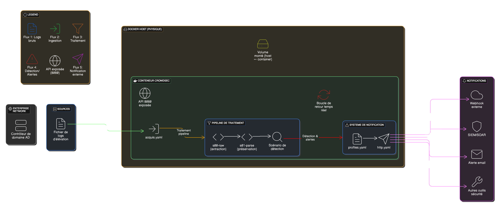
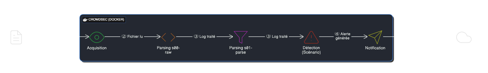
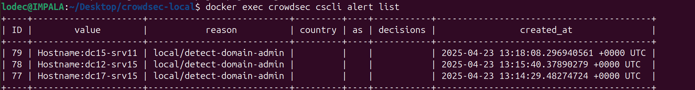
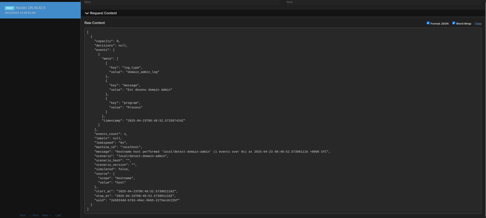

# CrowdSec - Détection d'élévation de privilèges Domain Admin

[](https://github.com/LouisDecourtis/crowdsecly/blob/master/LICENSE)
[](https://crowdsec.net/)
[](https://www.docker.com/)
[]()
[]()

<p align="center">
  
</p>

## Table des matières

- [Description](#description)
- [Fonctionnalités clés](#fonctionnalités-clés)
- [Démarrage rapide et Installation](#démarrage-rapide-et-installation)
- [Architecture](#architecture)
  - [Diagramme de séquence](#diagramme-de-séquence)
- [Prérequis](#prérequis)
- [Configuration](#configuration)
  - [Acquisition des logs](#acquisition-des-logs)
  - [Parsers](#parsers)
  - [Scénario](#scénario)
  - [Profil de notification](#profil-de-notification)
  - [Webhook](#webhook)
- [Utilisation](#utilisation)
  - [Tester la détection](#tester-la-détection)
  - [Visualisation des alertes](#visualisation-des-alertes)
  - [Notifications Webhook](#notifications-webhook)
- [Structure des fichiers](#structure-des-fichiers)
- [Dépannage](#dépannage)
- [Contribuer](#contribuer)
- [Licence](#licence)

## Description

Ce projet implémente une solution de détection d'élévation de privilèges domain admin en utilisant CrowdSec, une solution open-source de sécurité collaborative. Le système analyse les logs pour détecter quand un utilisateur devient domain admin et génère des alertes en temps réel.

## Fonctionnalités clés

<table>
  <tr>
    <td align="center"><b>🔍</b></td>
    <td><b>Détection en temps réel</b> des élévations de privilèges domain admin</td>
  </tr>
  <tr>
    <td align="center"><b>🔄</b></td>
    <td><b>Pipeline de traitement</b> configurable pour l'analyse des logs</td>
  </tr>
  <tr>
    <td align="center"><b>🚨</b></td>
    <td><b>Alertes instantanées</b> via webhook pour réponse rapide aux incidents</td>
  </tr>
  <tr>
    <td align="center"><b>🐳</b></td>
    <td><b>Déploiement Docker</b> simplifié pour une mise en place rapide</td>
  </tr>
  <tr>
    <td align="center"><b>🔌</b></td>
    <td><b>Intégration facile</b> avec d'autres systèmes de sécurité (SIEM, SOAR)</td>
  </tr>
</table>

## Démarrage rapide et Installation

```bash
# 1. Cloner le dépôt
git clone https://github.com/LouisDecourtis/crowdsecly.git
cd crowdsecly

# 2. Démarrer CrowdSec
docker run -d --name crowdsec \
  -p 8080:8080 \
  -v $(pwd)/config:/etc/crowdsec \
  -v $(pwd)/data:/var/lib/crowdsec/data \
  -v $(pwd)/tests:/tests \
  crowdsecurity/crowdsec:latest

# 3. Tester la détection
echo "May 1 12:34:56 host Process: Est devenu domain Admin" >> tests/nginx/nginx.log

# 4. Vérifier les alertes
docker exec crowdsec cscli alerts list
```

## Architecture

Le projet utilise une architecture basée sur Docker pour faciliter le déploiement et l'isolation. Les composants principaux sont :

- **CrowdSec** : Moteur d'analyse et de détection
- **Parsers personnalisés** : Pour traiter les logs spécifiques d'élévation de privilèges
- **Scénario de détection** : Règle qui déclenche une alerte lorsqu'un utilisateur devient domain admin

Le flux de données est le suivant :
1. Les logs sont écrits dans un fichier de test
2. CrowdSec surveille ce fichier et analyse les nouvelles entrées
3. Les parsers extraient les informations pertinentes
4. Le scénario évalue si une élévation de privilèges a eu lieu
5. Une alerte est générée si le scénario est déclenché

<p align="center">
  
</p>

> **Note**: Les intégrations avec les SIEM/SOAR et les alertes par email visibles sur le diagramme ne sont pas encore implémentées dans ce projet. Elles sont représentées à titre indicatif pour montrer les possibilités d'extension du système.

### Diagramme de séquence

Le diagramme ci-dessous illustre la séquence des opérations depuis la génération d'un log jusqu'à l'envoi de la notification :

<p align="center">
  
</p>

## Prérequis

- Docker
- Accès en lecture/écriture au répertoire du projet

## Configuration

### Structure des fichiers

```
crowdsec-local/
├── config/                      # Configuration CrowdSec
│   ├── acquis.yaml              # Configuration d'acquisition des logs
│   ├── notifications/
│   │   └── http.yaml            # Configuration des notifications webhook
│   ├── parsers/
│   │   ├── s00-raw/
│   │   │   └── custom-domain-admin-parser.yaml  # Parser initial
│   │   └── s01-parse/
│   │       └── domain-admin-s01.yaml           # Parser de préservation
│   ├── profiles.yaml            # Profils de notification et de décision
│   └── scenarios/
│       └── detect-domain-admin.yaml            # Scénario de détection
├── data/                        # Données persistantes CrowdSec
└── tests/                       # Répertoire de test
    └── nginx/
        └── nginx.log            # Fichier de log de test
```

### Parsers personnalisés

Deux parsers personnalisés ont été créés pour traiter correctement les logs d'élévation de privilèges :

#### 1. Parser initial (s00-raw)

Ce parser extrait les informations de base du log au format syslog :

```yaml
# config/parsers/s00-raw/custom-domain-admin-parser.yaml
filter: "evt.Line.Labels.type == 'syslog'"
name: local/domain-admin-parser
description: "Parser pour détecter les logs d'élévation de privilèges domain admin"
debug: true
onsuccess: next_stage
nodes:
  - grok:
      pattern: "%{SYSLOGTIMESTAMP:timestamp} %{HOSTNAME:hostname} %{DATA:program}: %{GREEDYDATA:message}"
      apply_on: Line.Raw
statics:
  - meta: program
    expression: evt.Parsed.program
  - meta: message
    expression: evt.Parsed.message
  - meta: log_type
    value: domain_admin_log
```

#### 2. Parser de préservation (s01-parse)

Ce parser s'assure que les logs identifiés comme "domain_admin_log" ne sont pas abandonnés au stage s01-parse :

```yaml
# config/parsers/s01-parse/domain-admin-s01.yaml
filter: "evt.Meta.log_type == 'domain_admin_log'"
name: local/domain-admin-s01
description: "Parser pour préserver les logs domain admin en s01-parse"
debug: true
onsuccess: next_stage
statics:
  - parsed: domain_admin
    value: "true"
```

### Scénario de détection

Le scénario qui déclenche une alerte lorsqu'un utilisateur devient domain admin :

```yaml
# config/scenarios/detect-domain-admin.yaml
type: trigger
name: local/detect-domain-admin
description: "Détecte le log 'Est devenu domain Admin'"
filter: "Match('Est devenu domain Admin', evt.Parsed.message) || Match('Est devenu domain Admin', evt.Meta.message)"
scope:
  type: Hostname
  expression: evt.Parsed.hostname
labels:
  severity: info
  service: custom
```

## Utilisation

### Démarrage

Pour démarrer le conteneur CrowdSec :

```bash
docker start crowdsec
```

Si vous devez le redémarrer après des modifications de configuration :

```bash
docker restart crowdsec
```

### Test

Pour tester la détection, ajoutez une entrée de log simulant une élévation de privilèges :

```bash
echo "May 1 12:34:56 host Process: Est devenu domain Admin" >> tests/nginx/nginx.log
```

### Visualisation des alertes

Pour vérifier si une alerte a été générée :

```bash
docker exec crowdsec cscli alerts list
```

<p align="center">
  
</p>

### Notifications Webhook

Le système est configuré pour envoyer automatiquement des notifications à un webhook lorsqu'une alerte d'élévation de privilèges domain admin est détectée. Cette fonctionnalité permet d'intégrer facilement la détection avec d'autres systèmes ou outils.

#### Configuration des notifications

La configuration des notifications se fait en deux parties :

1. **Configuration du webhook** dans `config/notifications/http.yaml` :
   ```yaml
   type: http
   name: http_default
   log_level: info
   format: |
     {{.|toJson}}
   url: https://webhook.site/votre-webhook-id
   method: POST
   ```

2. **Profil de notification** dans `config/profiles.yaml` :
   ```yaml
   name: domain_admin_notification
   debug: true
   filters:
     - Alert.GetScenario() == "local/detect-domain-admin"
   decisions: []  # Pas de décision de remédiation, juste une notification
   notifications:
     - http_default
   on_success: continue
   ```

#### Flux de traitement complet

Voici comment fonctionne le processus de bout en bout :

1. **Log d'origine** : Une entrée de log est détectée
   ```
   May 1 12:34:56 host Process: Est devenu domain Admin
   ```

2. **Parsing initial** : Le parser `custom-domain-admin-parser.yaml` extrait les champs
   ```yaml
   # Champs extraits
   timestamp: May 1 12:34:56
   hostname: host
   program: Process
   message: Est devenu domain Admin
   log_type: domain_admin_log
   ```

3. **Préservation** : Le parser `domain-admin-s01.yaml` préserve le log en stage s01-parse

4. **Détection** : Le scénario `detect-domain-admin.yaml` détecte le message spécifique

5. **Notification** : Le profil `domain_admin_notification` envoie une alerte au webhook

#### Exemple de payload webhook

<p align="center">
  
</p>

Cette intégration permet d'automatiser les réponses aux incidents d'élévation de privilèges, en connectant la détection à d'autres systèmes comme des SIEM, des outils de ticketing, ou des systèmes d'alertes.

## Dépannage

### Logs de débogage

Pour voir les logs détaillés de CrowdSec :

```bash
docker logs crowdsec
```

### Mode trace

Pour exécuter CrowdSec en mode trace et voir comment les logs sont traités :

```bash
docker exec -it crowdsec crowdsec -c /etc/crowdsec/config.yaml -dsn file:///tests/nginx/nginx.log -type syslog -no-api -trace
```

### Problèmes courants

1. **Aucune alerte n'est générée** :
   - Vérifiez que le format du log correspond au pattern attendu
   - Assurez-vous que les parsers sont correctement chargés (`docker exec crowdsec cscli parsers list`)
   - Vérifiez que le scénario est actif (`docker exec crowdsec cscli scenarios list`)

2. **Container qui crash** :
   - Vérifiez la syntaxe YAML des fichiers de configuration
   - Assurez-vous que les expressions dans les filtres sont valides

## Fonctionnement technique

### Pipeline de traitement CrowdSec

CrowdSec traite les logs en plusieurs étapes :

1. **s00-raw** : Parsing initial des logs bruts
   - Notre parser `custom-domain-admin-parser.yaml` extrait les champs de base

2. **s01-parse** : Parsing spécifique par application
   - Notre parser `domain-admin-s01.yaml` préserve les logs pour qu'ils ne soient pas abandonnés

3. **s02-enrich** : Enrichissement des données
   - Les parsers standard ajoutent des informations contextuelles

4. **Évaluation des scénarios**
   - Notre scénario `detect-domain-admin.yaml` vérifie si le message contient "Est devenu domain Admin"

5. **Génération d'alertes**
   - Une alerte est créée avec le hostname comme scope

Cette architecture modulaire permet d'adapter facilement le système à d'autres types de détection en ajoutant de nouveaux parsers et scénarios.

## Contribuer

Les contributions à ce projet sont les bienvenues ! Voici comment vous pouvez contribuer :

1. **Fork** le projet
2. Créez votre branche de fonctionnalité (`git checkout -b feature/AmazingFeature`)
3. Committez vos changements (`git commit -m 'Add some AmazingFeature'`)
4. Poussez vers la branche (`git push origin feature/AmazingFeature`)
5. Ouvrez une **Pull Request**

Vous pouvez également contribuer en :

- Signalant des bugs
- Proposant de nouvelles fonctionnalités
- Améliorant la documentation

## Licence

Ce projet est distribué sous licence MIT. Voir le fichier `LICENSE` pour plus d'informations.

---
<p align="center">
  <sub>Développé avec ❤️ par Louis pour la sécurité des infrastructures</sub>
</p>
